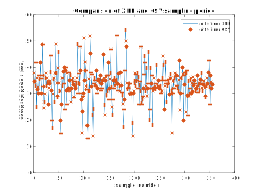
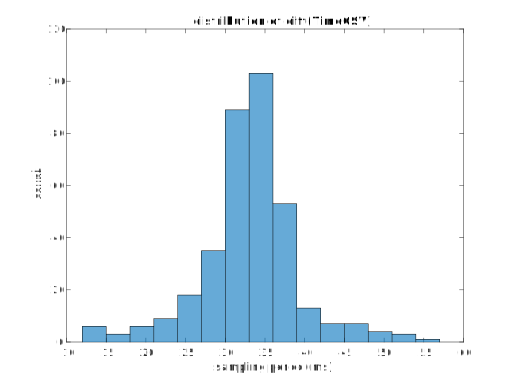
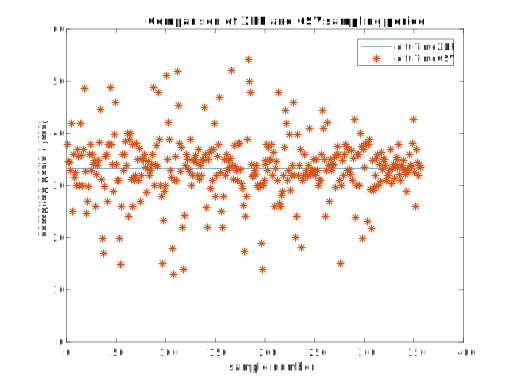

# LslKInectAnalysis

## Usage
Clone or download the repository.  
Run `main` within matlab.

## Goal
The general goal is to check time consistency in files provided by [LSL-Kinect](https://github.com/Benoit-Prigent/LSL-Kinect).

## Input data
- `LSL.xdf`: all in one XDF file.
  - `Markers` stream :
    - string messages
  - `MoCap` stream (:warning: line wise organisation ):
    - `Timestamp` as recorded by the LSL-Kinect computer (Unix Time)
    - `SpineBase_X`, position X (meter)
    - `SpineBase_Y`, position Y (meter)
    - `SpineBase_Z`, position Z (meter)
    - `SpineBase_Conf`, confidence (normalized)
    - ... etc.
- `Markers.csv`: identical to the `Markers` stream in the XDF
- `MoCap.csv` (column wise organisation): identical to the `MoCap` stream in the XDF
  - `Timestamp` as recorded by the LSL-Kinect computer (Unix Time)
  - ... etc.

## Reading files  
- `LSL.xdf`: loaded by the LSL provided function `load_xdf` (for the last version, see https://github.com/sccn/xdf/. A copy of `load_xdf` is provided in this repository for convenience).
  - IMPORTANT : I use the option `'HandleJitterRemoval', false`. The latter is mandatory to get the RAW timestamps.
- `Markers.csv`: not loaded
- `MoCap.csv`: loaded by `importKinectCSV`, a matlab generated function (`uiopen` allows to built this function for you after visual check : handy!). Alternatively, you can use `csvread` to do the same, but it is 3 times slower.  

## Analyses
- `TimeCSV` is the time recorded in LSL-Kinect, before broadcast by LSL.
- `TimeXDF` is the time recorded in the XDF, after broadcast by LSL.

NB : because the zero of time is not the same in XDF and CSV, most analyses focus on the time difference from one sample to the next (i.e., the sampling period).

## Results

### Network transmission noise
The figure below reveals that :
- the export to CSV and to XDF is identical (good to check, but expected...)
- the broadcast by LSL introduces **transmission noise** (again, expected). Note that, as far as transmission noise is concerned :
  - the central tendency is about 0 (I would have expected positive values if a transmission delay)
  - the dispersion is homogenous and stays within 1 millisecond (LSL is fast...)

### Variability in Kinect sampling rate

The figure below reveals that:
- the sampling period looks very well preserved by LSL (lines and star are congruent). This is an expected good news.
- the sampling period of LSL-Kinect is centred on 33 ms (good news, this corresponds to the 30Hz nominal sampling of the Kinect). Yet, the sampling period is also very variable... and this is a bad news.

To go a bit more into the variability of the sampling rate, we take a look at the shape of its distribution. The figure below reveals that:
- the dispersion ressembles a normal distribution
- rather symmetrical
- maybe slightly too peaky

### Using `load_xdf` to cancel jitter in time
The option `'HandleJitterRemoval', true` in the reader function `load_xdf` makes important changes in the timestamps. The figure below reveals that the option :
- is very efficient
  - it removes any jitter in the sampling period (blue horizontal line)
  - it chooses the average sampling well
- cancels out every variability
  - due to fluctuations in broadcast (this was expected)
  - due to fluctuations in Kinect. This can raise problems, if the Kinect **does change** its sampling rate (15 to 30 or 30 to 15 Hz).  This happens [if light conditions change](https://social.msdn.microsoft.com/Forums/en-US/32fbce96-c058-43da-8493-a822b08fdb77/kinect-sample-rate?forum=kinectv2sdk) or [due to computer performance](https://journals.plos.org/plosone/article?id=10.1371/journal.pone.0202338).

## Conclusions

1°)  LSL-Kinect provides adequate time in CSV and XDF_CSV_time

2°)  The option `'HandleJitterRemoval', true` should be used carefully... This option is valid if the Kinect does not switch from 30 Hz to 15 Hz (due to changes in lighting).
The option `'HandleJitterRemoval', true` might be used if **changes in sample rate are checked in the Marker stream**.

The function `CheckLSLKinectSampling` checks wether the sampling rate of the Kinect changed and raises a warning if this is the case. `CheckLSLKinectSampling` reads the `Markers` stream of LSL-Kinect seeking for messages about sampling rate changes.
