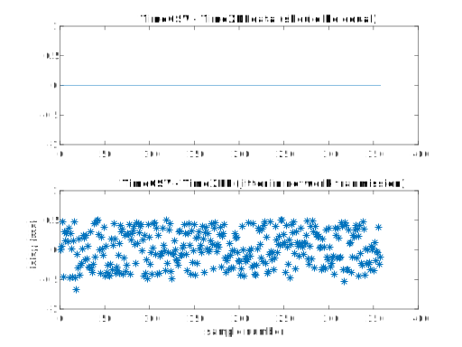

# LslKInectAnalysis

## Usage
Clone or download the repository
 add the `load_xdf` function into yo

The goal is to check time consistency in files provided by LSL-Kinect

## Input data
- `LSL.xdf`: all in one XDF file
- `Markers.csv`: identical to the 'Markers' stream in the XDF
- `MoCap.csv`: identical to the 'MoCap' stream in the XDF

## Reading files  
- `LSL.xdf`: loaded by the LSL provided function `load_xdf` (see https://github.com/sccn/xdf/).
  - IMPORTANT : I use the option `'HandleJitterRemoval', false`. The latter is mandatory to get the RAW timestamps.
- `Markers.csv`: not loaded
- `MoCap.csv`: loaded by `importKinectCSV`, a matlab generated function (`uiopen` allows to built this function for you)

## Analyses
- `TimeCSV` is the time recorded in LSL-Kinect, before broadcast by LSL.
- `TimeXDF` is the time recorded in the XDF, after broadcast by LSL.

NB : because the T_0 is not the same in XDF and CSV, most analyses focus on the time difference from one sample to the next.

## Results

### Network transmission noise
The figure below reveals that :
- the export to CSV and to XDF is identical (good to check, but expected...)
- the broadcast by LSL introduces **transmission noise** (again, expected). Note that, as far as transmission noise is concerned :
  - the central tendency is about 0 (I would have expected positive values if a transmission delay)
  - the dispersion is homogenous and stays within 1 millisecond (LSL is fast...)

### Variability in Kinect sampling rate

The figure below reveals that:
- the sampling period looks very well preserved by LSL (lines and star are congruent). This is an expected good news.
- the sampling period of LSL-Kinect is centred on 33 ms (good news, this corresponds to the 30Hz nominal sampling of the Kinect). Yet, the sampling period is also very variable... and this is a bad news.

To go a bit more into the variability of the sampling rate, we take a look at the shape of its distribution. The figure below reveals that:
- the dispersion ressembles a normal distribution
- rather symmetrical
- maybe slightly too peaky

### Using `load_xdf` to cancel jitter in time
The option `'HandleJitterRemoval', true` in the reader `load_xdf` makes important changes in the timestamps. The figure below reveals that the option :
- is very efficient
  - it removes any jitter in sampling period
  - it chooses the average sampling well
- cancels out every variability
  - due to fluctuations in Kinect
  - due to fluctuations in broadcast

## Conclusions

1°)  LSL-Kinect provides adequate time in CSV and XDF_CSV_time

2°)  The option `'HandleJitterRemoval', true` should be used carefully... This option is valid if the Kinect does not switch from 30 Hz to 15 Hz (due to changes in lighting).
The option `'HandleJitterRemoval', true` might be used if **changes in sample rate are checked in the Marker stream**.

The function `CheckLSLKinectSampling` checks wether the sampling rate of the Kinect changed and raises a warning if this is the case. `CheckLSLKinectSampling` reads the `Markers` stream of LSL-Kinect seeking for messages about sampling rate changes.
